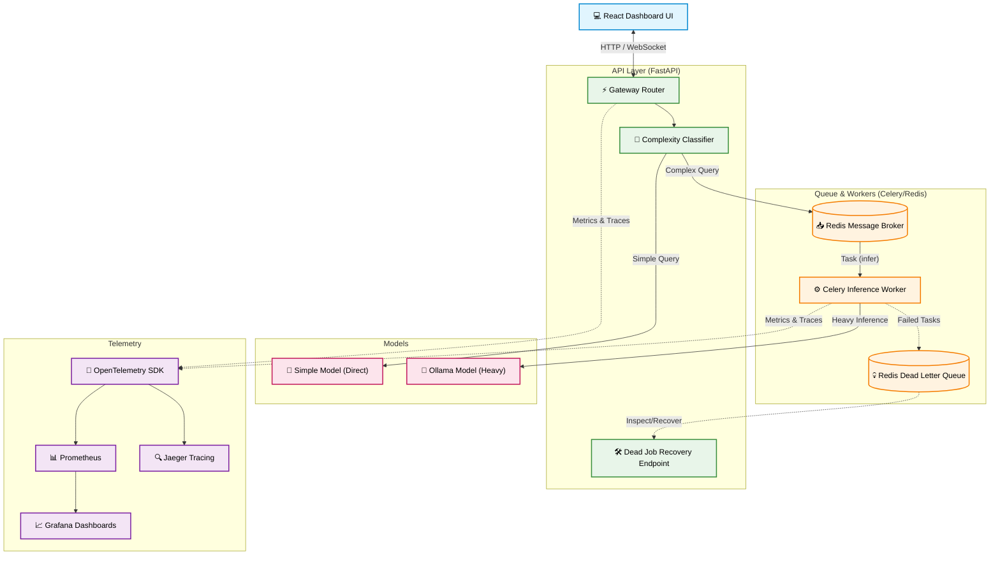

# Inference Gateway

A scalable, observable, and robust inference gateway bridging a backend FastAPI application with a React-based frontend dashboard. 

The system provides intelligent request routing, queueing with dead-letter recovery, comprehensive observability, and containerized deployment definitions.

## Architecture Flowchart

## Project Structure

The project is structured into two primary components:

1. **`inference-gateway/`** - Backend Gateway Services
2. **`inference-gateway-ui/`** - Frontend React Dashboard

---

## Backend (`inference-gateway/`)

The backend architecture is designed across five phases to ensure a resilient and scalable inference platform.

### Phase 1: Core Gateway
- **FastAPI App Skeleton:** High-performance, async-first API framework.
- **Pydantic Config & SLA Thresholds:** Strongly typed configuration and Service Level Agreement definitions.
- **Ollama Client:** Asynchronous `httpx` client for interacting with Ollama models.
- **Basic Model Router:** A complexity classifier that dynamically routes requests to the appropriate model based on query complexity.

### Phase 2: Queue & Dead Letter Queue (DLQ)
- **Broker Setup:** Celery + Redis architecture for handling asynchronous inference tasks.
- **Task Definitions:** Predefined tasks for inference requests and retry logic.
- **Redis Streams DLQ:** Reliable Dead Letter Queue for managing and storing failed inference jobs.
- **Dead Job Recovery:** Dedicated endpoints to inspect and safely recover failed jobs from the DLQ.

### Phase 3: Observability
- **OpenTelemetry (OTel) SDK:** Comprehensive instrumentation across the gateway.
- **Performance Tracing:** `perf_counter` spans capturing detailed latency metrics per request.
- **Prometheus Metrics Exporter:** Exporting vital system and custom performance metrics.
- **Jaeger Trace Exporter:** Distributed tracing to track individual requests through the gateway and workers.
- **Grafana Dashboards:** Provisioned-as-code dashboards for immediate insight into system health, queue depth, and SLAs.

### Phase 4: Kubernetes Deployment
- **Minikube Setup:** Local development cluster configuration.
- **Manifests:** Deployment and Service definitions for backend components.
- **Horizontal Pod Autoscaling (HPA):** Dynamic scaling based on CPU utilization and Redis queue depth.
- **ConfigMaps:** Dynamic configuration injection for SLA thresholds without requiring pod restarts.

### Phase 5: Production Deployment (Render)
- **Render Setup:** `render.yaml` configuration for seamless PaaS deployment.
- **Dockerfile:** Production-optimized, multi-stage container images.
- **Managed Redis:** Utilizing Render's managed Redis instances for maximum reliability.

---

## Frontend (`inference-gateway-ui/`)

### Phase 6: React Dashboard
The frontend provides a real-time, interactive window into the gateway's operation and performance.
- **Tech Stack:** Built with Vite, React, Tailwind CSS, and Zustand for lightweight state management.
- **WebSocket Live Feed:** Real-time streaming of inference requests, completions, and system events.
- **Interactive Charts:** Powered by Recharts, visualizing key metrics like latency trends, model usage distribution, and active queue depth.
- **Request Inspector:** A dedicated trace viewer UI to inspect the complete lifecycle and routing decisions of individual inference requests.